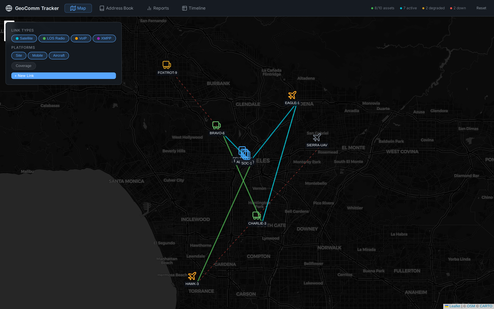
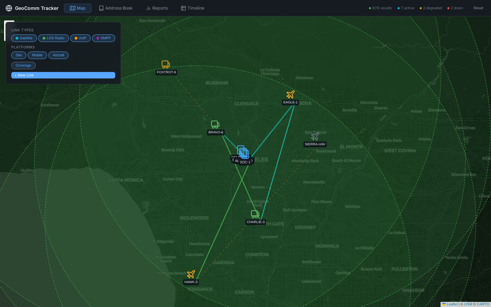
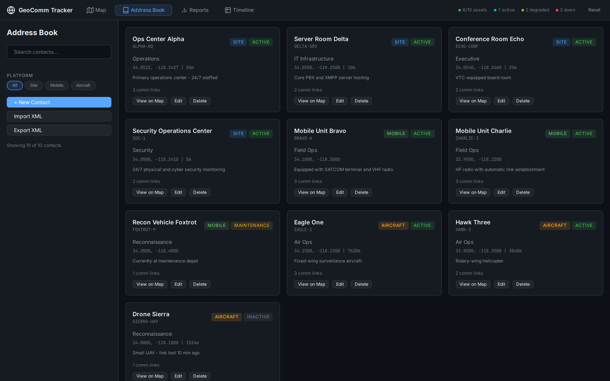
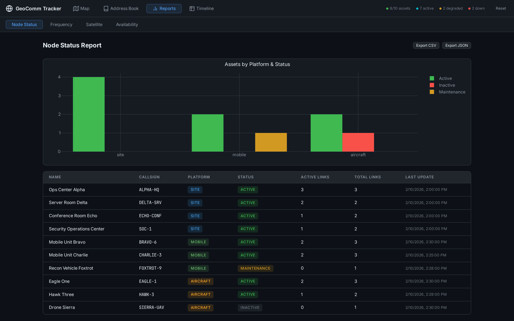
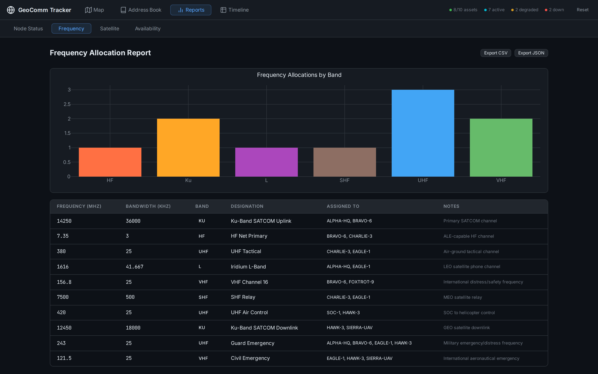
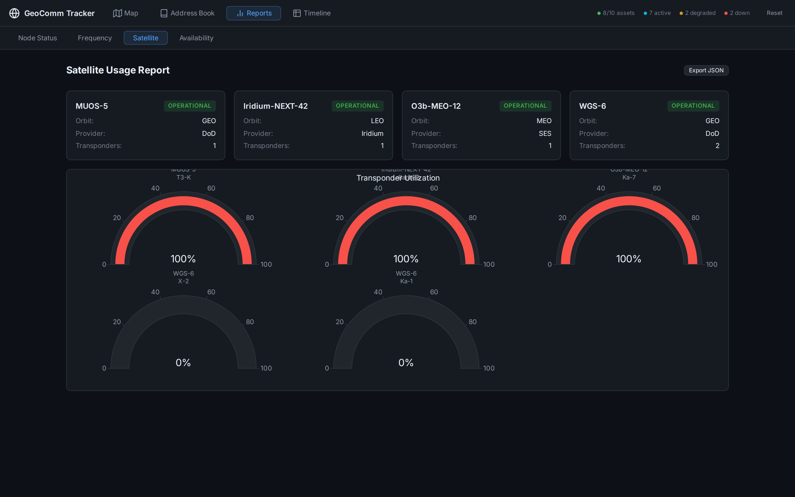
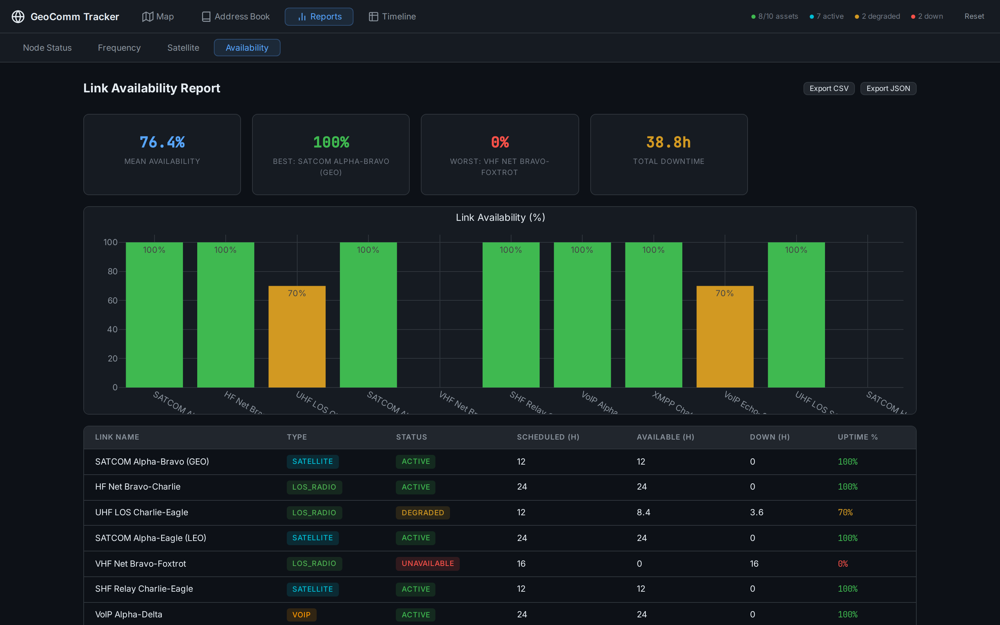
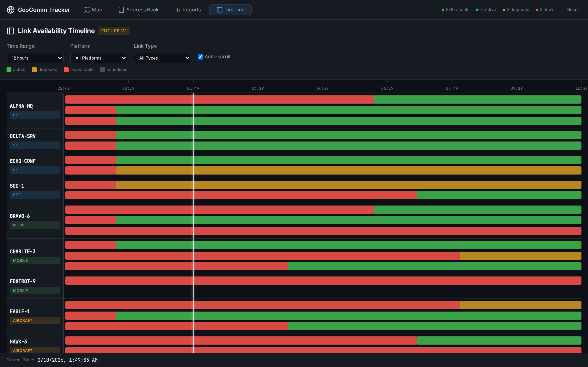

# GeoComm Tracker — Geographical Communication Link Tracking

A lightweight, web-based system for tracking and visualizing communication links within a geographical region. Monitors mobile ground units, aircraft, and fixed site assets connected via satellite (GEO/MEO/LEO), line-of-sight radio, VoIP, and XMPP.

Built with [OpenSpec](https://github.com/Fission-AI/OpenSpec) for specifications, [Commlink-Directory](https://github.com/mowgli42/Commlink-Directory) for the address book, and [Beads](https://github.com/steveyegge/beads) for progress tracking.

---

## Map View — Operational Picture



The default view is a dark-themed **Leaflet.js** map centered on the operational area (Los Angeles basin in the demo). Every tracked asset appears as a custom icon based on its platform type:

- **Buildings** (blue) = fixed **site** installations (ops centers, server rooms, security)
- **Trucks** (green) = **mobile** ground units (field teams, recon vehicles)
- **Aircraft** (orange) = **airborne** platforms (fixed-wing, rotary, UAV)

Communication links between assets are drawn as colored lines, with both **color** and **line style** encoding information at a glance:

| Line Color | Link Type |
|-----------|-----------|
| Cyan | Satellite (GEO/MEO/LEO) |
| Green | Line-of-Sight Radio (HF/VHF/UHF/SHF) |
| Orange | VoIP |
| Purple | XMPP |

| Line Style | Link Status |
|-----------|-------------|
| Solid | Active |
| Dashed | Degraded |
| Dotted (red) | Unavailable |

The **control panel** (top-left) provides filter chips to toggle link types and platform categories, plus a **Coverage** toggle and **+ New Link** button. The **status bar** (top-right) displays live counts: active assets, active links, degraded links, and links that are down.

---

## Asset Detail Panel


Click any asset marker to slide open the **detail panel** on the right. It shows:

- **Identity**: name, callsign (monospace), platform badge, status badge
- **Position**: lat/lon coordinates, altitude, heading, speed
- **Department & Notes**: organizational context
- **Communication Links**: every link connected to this asset, each showing:
  - Link name and status badge
  - Type badge with subtype (e.g., "SATELLITE (GEO)")
  - Remote endpoint name (the other asset)
  - Frequency and modulation (e.g., "14250 MHz / QPSK")
  - Quality metrics (latency, signal strength)

Each link card is color-coded on the left border to match the link type color scheme.

---

## Coverage Overlay



Toggle the **Coverage** chip to display radio coverage circles around assets that have line-of-sight radio links. Circle radius is estimated by band:

| Band | Range |
|------|-------|
| HF | 200 km |
| VHF | 50 km |
| UHF | 40 km |
| SHF | 30 km |

Circles are drawn with dashed green outlines and semi-transparent fill, making it easy to see where radio coverage overlaps and where gaps exist.

---

## Address Book — Commlink-Directory Integration



The Address Book view is a card-based contact directory integrated with the [Commlink-Directory](https://github.com/mowgli42/Commlink-Directory) XML schema. Features:

- **Contact cards** show name, callsign, platform/status badges, department, coordinates, altitude, notes, and comm link count
- **Search** box filters contacts in real-time across all fields
- **Platform filter** chips (All / Site / Mobile / Aircraft) narrow the display
- **Import XML** parses Commlink-Directory XML files and preserves VoIP, XMPP, and Custom Services data
- **Export XML** generates schema-compliant XML with XSLT stylesheet reference
- **View on Map** button switches to the Map view and centers on the selected asset
- **Edit / Delete** buttons for full CRUD operations via a modal form

When importing XML, the parser extracts:
- General info (Name, Location, Department, Notes)
- VoIP settings (IP, Port, Extension, Codec, Protocol, Transport)
- XMPP settings (JID, Server, IP, Port, Encryption, Conference)
- Custom Services (ServiceName, IP, Port, Description)

All data round-trips through import and export without loss.

---

## Reports — Node Status



The Reports view has four tabs. The **Node Status** report provides:

- **Plotly.js bar chart**: assets grouped by platform (site/mobile/aircraft), segmented by status (active in green, inactive in red, maintenance in yellow)
- **Data table**: every asset with callsign, platform badge, status badge, active link count, total link count, and last position update timestamp
- **Export CSV / Export JSON** buttons for offline analysis

---

## Reports — Frequency Allocation



The **Frequency** tab shows how radio spectrum is allocated across the force:

- **Bar chart**: frequency count per band (HF, VHF, UHF, L, Ku, SHF), each band with its own color
- **Conflict detection**: automatically flags when two allocations overlap in frequency within the same coverage area
- **Table**: every allocated frequency with MHz, bandwidth (kHz), band, designation, assigned assets, and notes
- Exportable to CSV and JSON

---

## Reports — Satellite Usage



The **Satellite** tab monitors transponder utilization:

- **Summary cards**: one per satellite showing name, orbit type (GEO/MEO/LEO), provider, transponder count, and operational status
- **Gauge charts**: per-transponder utilization percentage with color thresholds (green <70%, yellow 70-90%, red >90%)
- Exportable to JSON

---

## Reports — Link Availability



The **Availability** tab is the operational health dashboard:

- **Summary cards** at the top: mean availability %, best link (name + uptime), worst link, and total downtime hours
- **Bar chart**: per-link uptime percentage, color-coded (green >90%, yellow 50-90%, red <50%)
- **Table**: every link with type, status, scheduled hours, available hours, downtime hours, and uptime percentage
- Exportable to CSV and JSON

---

## Guitar Hero Timeline — Link Availability Windows



The **Timeline** view (labeled "FUTURE v2") is a Guitar-Hero-inspired horizontal display showing when each comm link is available or unavailable for every asset:

- Each **row** is an asset (identified by callsign + platform badge)
- Each **sub-row** within an asset shows one comm link
- **Color blocks** encode status:
  - Green = **active** (link is up and operational)
  - Yellow = **degraded** (link has reduced capacity)
  - Red = **unavailable** (link is down)
  - Gray = **scheduled** (planned but not confirmed)
- A white **playhead cursor** marks the current time, advancing in real-time
- **Filters**: time range (6h/12h/24h/48h), platform, link type
- **Auto-scroll** keeps the playhead centered as time advances
- The **legend** at the top explains the color coding

This view gives operators an instant read on which assets have comms and which don't, across time.

---

## How It All Fits Together

```
┌──────────────────────────────────────────────────────────────┐
│                     GeoComm Tracker                           │
│                                                               │
│  ┌──────────┐  ┌──────────────┐  ┌─────────┐  ┌───────────┐ │
│  │ Map View │  │ Address Book │  │ Reports │  │ Timeline  │ │
│  │ (Leaflet)│  │ (Commlink    │  │ (Plotly)│  │ (Guitar   │ │
│  │          │  │  Directory)  │  │         │  │  Hero)    │ │
│  └────┬─────┘  └──────┬───────┘  └────┬────┘  └─────┬─────┘ │
│       │               │               │              │        │
│  ┌────┴───────────────┴───────────────┴──────────────┴─────┐ │
│  │              Svelte 5 Reactive Stores                    │ │
│  │  assets · commLinks · satellites · frequencies           │ │
│  └────────────────────────┬────────────────────────────────┘ │
│                           │                                   │
│  ┌────────────────────────┴────────────────────────────────┐ │
│  │           localStorage Persistence                       │ │
│  │  Data survives page refresh · Reset to seed available    │ │
│  └─────────────────────────────────────────────────────────┘ │
└──────────────────────────────────────────────────────────────┘
```

**Data flows** through four reactive Svelte stores (`assets`, `commLinks`, `satellites`, `frequencies`). Any change in one view — adding a contact in the Address Book, creating a link on the Map, editing frequency data — instantly propagates to all other views. The stores are persisted to `localStorage`, so all changes survive page refresh.

---

## Technology Stack

| Component | Technology | Why |
|-----------|-----------|-----|
| **UI Framework** | [Svelte 5](https://svelte.dev/) + SvelteKit | Compiled reactivity, smallest bundle, simplest DX |
| **Mapping** | [Leaflet.js](https://leafletjs.com/) | Open-source, lightweight (~40KB), no API key |
| **Charts** | [Plotly.js](https://plotly.com/javascript/) | Interactive, export-ready, no server needed |
| **Database** | JSON flat files + localStorage (v1) | Zero-config, portable, human-readable |
| **Address Book** | [Commlink-Directory](https://github.com/mowgli42/Commlink-Directory) XML | Existing enterprise contact standard |
| **Design** | CSS Custom Properties (dark theme) | IxDF-aligned, responsive, accessible |
| **Specs** | [OpenSpec](https://github.com/Fission-AI/OpenSpec) | Iterative, artifact-driven specifications |
| **Progress** | [Beads](https://github.com/steveyegge/beads) | Git-backed, agent-friendly task tracking |

---

## Quick Start

```bash
# Clone
git clone <this-repo>
cd geocomm-tracker

# Install and run
cd app
npm install
npm run dev
```

Open [http://localhost:5173](http://localhost:5173). The app loads with 10 sample assets, 11 comm links, 4 satellites, and 10 frequency allocations.

### Build for Production

```bash
npm run build    # Outputs to app/build/
npm run preview  # Preview the production build
```

The static build can be deployed to any web server — no backend required.

---

## Project Structure

```
.
├── README.md                          # This file
├── docs/screenshots/                  # Application screenshots
├── openspec/                          # OpenSpec specifications
│   ├── config.yaml                    # Project config
│   ├── project.md                     # Project overview
│   ├── specs/                         # Requirements & scenarios
│   │   ├── comm-tracking/spec.md      # Map & link tracking
│   │   ├── address-book/spec.md       # Commlink-Directory integration
│   │   ├── reports/spec.md            # Report generation
│   │   └── guitar-hero/spec.md        # Timeline display (v2)
│   └── changes/v1-.../                # Change proposal + design + tasks
├── .beads/                            # Beads progress tracking
│   ├── config.yaml
│   └── issues.jsonl                   # Task graph (3 epics, 35 tasks)
├── AGENTS.md                          # AI agent instructions
└── app/                               # SvelteKit application
    ├── src/
    │   ├── app.css                    # IxDF design system
    │   ├── routes/+page.svelte        # Main page (view switcher)
    │   └── lib/
    │       ├── data/
    │       │   ├── stores.js          # Reactive stores + persistence
    │       │   └── seed.js            # Sample data (10 assets, 11 links)
    │       ├── components/
    │       │   ├── map/               # MapView, AssetInfoPanel,
    │       │   │                      # LinkInfoPanel, LinkEditorModal
    │       │   ├── addressbook/       # AddressBookView (XML import/export)
    │       │   ├── reports/           # ReportsView (4 report tabs)
    │       │   ├── guitarhero/        # GuitarHeroView (timeline)
    │       │   └── ToastContainer.svelte
    │       └── utils/
    │           ├── xml.js             # Commlink-Directory XML I/O
    │           ├── reports.js         # Report data generators
    │           ├── persist.js         # localStorage persistence
    │           └── toast.js           # Shared toast notifications
    └── static/
        └── sample-directory.xml       # Sample Commlink-Directory file
```

---

## Design Principles (IxDF)

The interface follows [Interaction Design Foundation](https://www.interaction-design.org/) guidelines:

1. **Visibility of System Status** — The navbar always shows live counts of assets and link status. Color-coded badges and chart colors make state immediately visible.
2. **Match Between System and Real World** — Uses standard comm terminology: callsign, frequency, transponder, SATCOM, LOS, BER, dBm.
3. **User Control and Freedom** — Dismissible panels, modal cancel buttons, Reset to seed data, Esc key support.
4. **Consistency and Standards** — Same color coding everywhere (cyan=satellite, green=LOS, etc.), Commlink-Directory XML schema, standard report formats.
5. **Error Prevention** — Link editor validates endpoint selection, frequency ranges are typed inputs, duplicate detection in address book.
6. **Recognition Rather Than Recall** — Asset cards show all key info at a glance, filter chips persist state, badges labeled inline.
7. **Flexibility and Efficiency** — Filter chips, platform filters, time range selectors, CSV/JSON export, search box.
8. **Aesthetic and Minimalist Design** — Dark operational theme, no decoration, every pixel carries information.

---

## Beads Progress Tracking

| Epic | Tasks | Status |
|------|-------|--------|
| **bd-a1f0** v1 Core | 18 | All closed |
| **bd-c3d0** MVP Gap Fixes | 12 | All closed |
| **bd-b2e0** v2 Guitar Hero Live | 5 | Open (future) |

---

## Roadmap

### v1 (Current)
- [x] Interactive map with asset markers and comm link visualization
- [x] Commlink-Directory XML import/export (with VoIP/XMPP/Custom Services)
- [x] Node status, frequency, satellite, and availability reports
- [x] Guitar Hero timeline preview with availability blocks
- [x] localStorage persistence
- [x] Comm link CRUD (create, edit, delete with full field set)
- [x] Coverage overlay circles
- [x] IxDF dark-theme design system

### v2 (Future)
- [ ] Real-time comm link status data feeds
- [ ] Animated Guitar Hero playhead with auto-scroll
- [ ] Historical playback mode
- [ ] SQLite persistent storage backend
- [ ] Multi-region support
- [ ] WCAG 2.1 AA accessibility audit

---

## License

See [LICENSE](LICENSE) for details.
